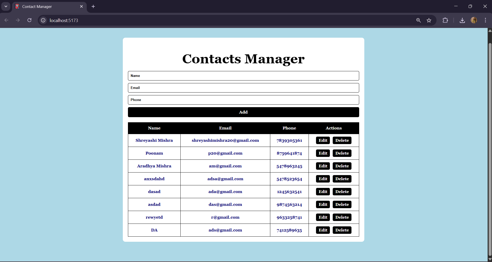

# MERN Stack Contacts Manager 📞

A simple **Contacts Manager** web application built using the **MERN stack** (MongoDB, Express.js, React.js, Node.js).  
This app allows you to **add, view, update, and delete contacts** with a clean, minimal interface.  

---

## Features ✨

- Add new contacts (Name, Email, Phone)  
- View all contacts in a table  
- Edit existing contacts  
- Delete contacts  
- Minimal styling with **light blue, white, and black** colors  

---

## Tech Stack 🛠️

- **Frontend:** React.js, Axios, HTML, CSS  
- **Backend:** Node.js, Express.js  
- **Database:** MongoDB (MongoDB Atlas or local)  

---

## Screenshot 🖼️


---

## Folder Structure 📁

```text
contact-manager/
├── backend/          # Node.js + Express backend
│   ├── models/       # MongoDB models
│   ├── routes/       # API routes
│   └── server.js     # Main server file
├── frontend/         # React frontend
│   ├── src/
│   ├── public/
│   └── package.json
├── .gitignore
└── README.md
